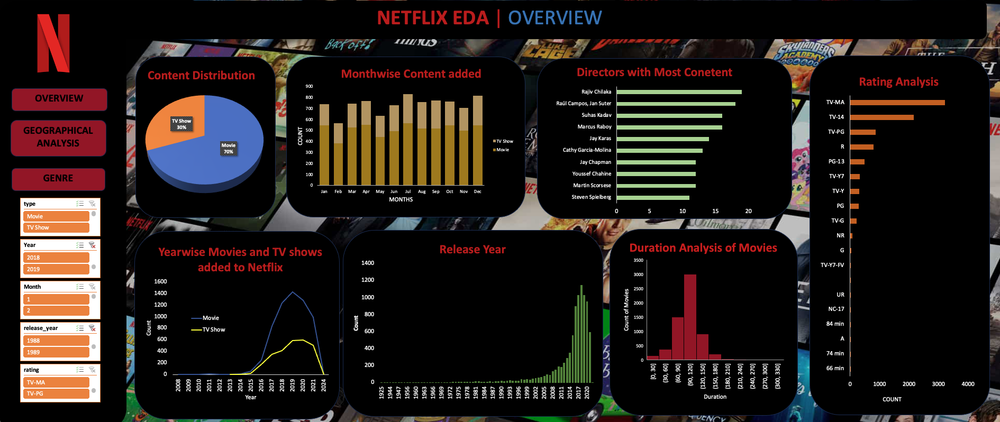
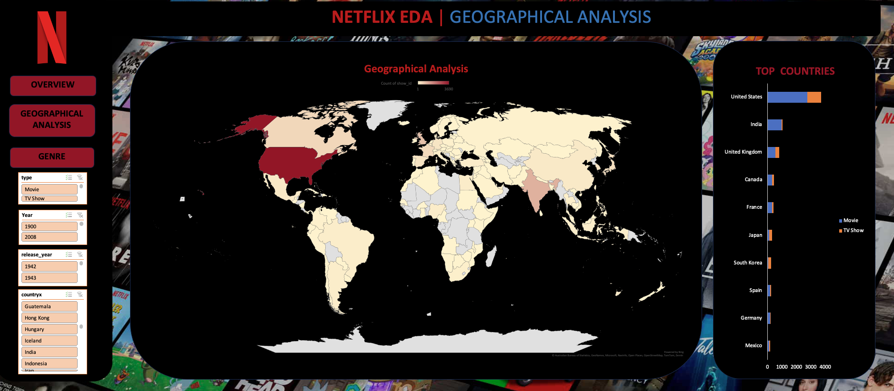
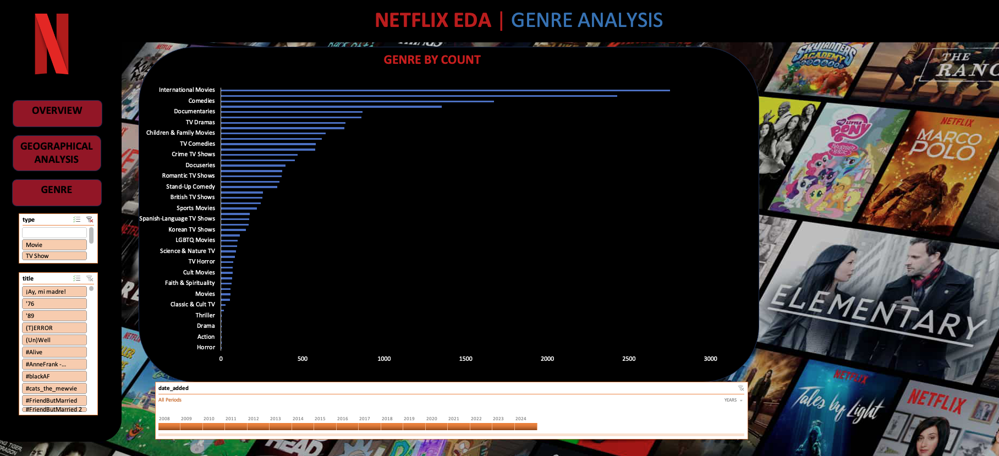

# Netflix Content Analysis Project

## Overview

This project analyzes the Netflix Titles dataset to uncover insights into the content available on Netflix. The dataset includes various attributes such as title type, director, cast, country of production, release year, rating, duration, genres, and a brief description.

## Dataset

The Netflix Titles dataset is a comprehensive compilation of movies and TV shows available on Netflix. [LINK](https://www.kaggle.com/datasets/rahulvyasm/netflix-movies-and-tv-shows/data).  The dataset contains the following columns:
- `show_id`: A unique identifier for each title.
- `type`: The category of the title (Movie or TV Show).
- `title`: The name of the movie or TV show.
- `director`: The director(s) of the movie or TV show.
- `cast`: The list of main actors/actresses in the title.
- `country`: The country or countries where the movie or TV show was produced.
- `date_added`: The date the title was added to Netflix.
- `release_year`: The year the movie or TV show was originally released.
- `rating`: The age rating of the title.
- `duration`: The duration of the title in minutes for movies and seasons for TV shows.
- `listed_in`: The genres the title falls under.
- `description`: A brief summary of the title.

## Tools and Techniques Used

### Excel
- **Data Cleaning**: Removed extra empty columns and handled missing values using Excel functions and tools.
- **Column Addition**: Added new columns such as `Year_added` and `Month_added` using `YEAR()` and `MONTH()` functions.
- **Data Processing**: Used Excel functions like `IF()`, `ISNULL()`, and text functions to process and clean data.
- **Pivot Tables**: Created pivot tables to summarize data and perform exploratory data analysis.
- **Charts and Graphs**: Created various charts and graphs to visualize the data trends and patterns.

## Data Cleaning and Processing

1. **Importing Data**: The Netflix_titles.csv file was imported from Kaggle.com. [LINK](https://www.kaggle.com/datasets/rahulvyasm/netflix-movies-and-tv-shows/data)
2. **Removing Empty Columns**: Extra empty columns were removed using Power Query Editor.
3. **Adding Columns**: Added columns for `Year_added` and `Month_added` to capture when content was added to Netflix.
4. **Handling Missing Values**: Checked for missing values and sorted the percentile of missing values using conditional formatting.
5. **Extracting Duration**: Created additional columns `duration_movies` and `duration_tv` by extracting values from the `duration` column.

## Data Analysis

### Design & Analysis
- **Content Distribution**: Analyzing the distribution of movies and TV shows on Netflix.
- **Yearly and Monthly Distribution**: Visualizing content added over the years and months.
- **Release Year**: Analyzing the distribution of content by release year.
- **Rating Analysis**: Examining the distribution of content ratings.
- **Duration Analysis**: Understanding the duration distribution for movies and TV shows.
- **Directors with Most Content**: Identifying directors with the most content on Netflix.

### Duration Analysis
- **Movies Duration**: Analysis of movie durations.
- **TV Shows Seasons**: Analysis of the number of seasons for TV shows.

### Geographical Analysis
- **Country Analysis**: Visualizing the geographical distribution of Netflix content production.

### Genre Analysis
- **Genres Distribution**: Analyzing the distribution of genres on Netflix.

## Data Visualization 

### Overview Dashboard
- **Charts Included**:
  - Content distribution
  - Monthly content added
  - Yearly content added
  - Release date distribution
  - Rating analysis
  - Duration analysis for movies
  - Directors with most content
- **Slicers**: Type, year, month, release year, rating

### Geographical Dashboard
- **Charts Included**:
  - Geographical analysis map
  - Top countries by content production
- **Slicers**: Type, year, release year, country

### Genre Dashboard
- **Charts Included**:
  - Genre distribution by count
- **Timeline**: Years, quarters, months, days
- **Slicers**: Type, title

## Acknowledgements

This project uses the Netflix Titles dataset from Kaggle. The data was used to explore and visualize trends, duration, ratings, geographical distribution, and genre popularity of Netflix content.
